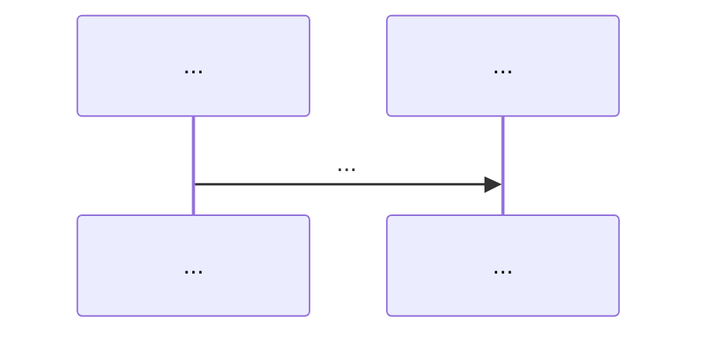

# {主题标题} — 本质与 BillMind 实现

> 里程碑：**M{n}** · 代码入口：`{典型代码路径}`

## 一句话本质

{用一句话说明该技术在 BillMind 中的角色}

---

## 常见误解 vs 本质

| 误解 | 本质 |
|------|------|
| {误解 1} | {本质 1} |
| {误解 2} | {本质 2} |

---

## 核心流程

### Step 1 — {步骤名}

{说明 + 代码引用}

### Step 2 — {步骤名}

{说明 + 代码引用}

---

## 关键概念

| 概念 | 说明 |
|------|------|
| {概念} | {说明} |

---

## 与相邻技术对比

| 维度 | {本主题} | {相邻主题} |
|------|----------|------------|
| ... | ... | ... |

---

## BillMind 代码对照表

| 步骤 / 概念 | 文件 / 函数 | 说明 |
|-------------|-------------|------|
| ... | ... | ... |

---

## 常见误区

1. **{误区}** — {纠正}
2. ...

---

## 官方文档

- {链接 1}
- {链接 2}

---

## 里程碑与延伸阅读

- 课表对应节：[docs/learning-plan.md](../../docs/learning-plan.md)
- 索引：[docs/knowledge/README.md](../../docs/knowledge/README.md)
