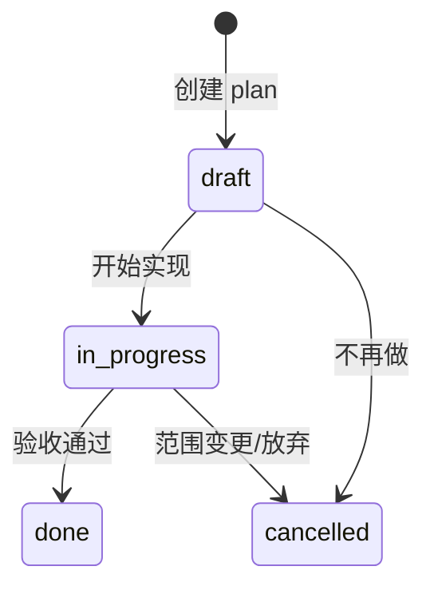

# implement-plan — 定 Plan 并实现功能

从「用户提出功能」到「代码落地 + 进度同步」的完整 SOP。Plan **必须**写入 [Changes/](../../Changes/)，按里程碑顺序号递增存储。

## 何时触发

- 用户要求实现某个功能、里程碑、或较大改动
- 用户说「做个 plan 然后实现」「按 milestones 做 M2」
- 任务跨多个文件/目录，需要先对齐范围再动手

**不触发**（直接改代码即可）：

- 单行 bugfix、改 typo
- 纯问答、代码 review
- 用户明确说「不要写 plan，直接改」

## 前置条件

- 已读 [Rules/00-core.md](../../Rules/00-core.md)
- 确认功能是否对应 [Wiki/milestones.md](../../Wiki/milestones.md) 中某个 M{n}
- 复制 [Changes/_template.plan](../../Changes/_template.plan) 作为起点

## 命名与顺序号

### 文件命名

```
M{n}_{seq}-{slug}.plan
```

| 部分 | 说明 | 示例 |
|------|------|------|
| `n` | 里程碑编号 0–13 | `M2` |
| `seq` | **该里程碑下**从 1 递增的顺序号 | `_1`、`_2`、`_3` |
| `slug` | 短英文 kebab-case | `function-calling` |

示例：

- `M0_1-langchain-text.plan`
- `M0_2-ollama-vision.plan`
- `M2_1-function-calling.plan`
- `M2_2-db-tools.plan`（同一里程碑拆多个交付单）

### 分配下一个 seq

1. 列出 `Changes/M{n}_*.plan`（不含 `_template.plan`）
2. 从文件名解析 `{seq}`（`M2_3-foo` → `3`）
3. 新 plan 的 seq = `max(seq) + 1`；若无已有文件则从 `1` 开始

```bash
ls .harness/Changes/M2_*.plan 2>/dev/null
```

## Plan frontmatter

每个 `.plan` 文件头必须含 YAML frontmatter：

```yaml
---
milestone: M2          # 对应 milestones 表中的 M{n}
seq: 1                 # 与文件名 M2_1 一致
slug: function-calling # 与文件名一致
status: draft          # draft | in_progress | done | cancelled
skills:                # 实现时引用的 Skill 路径（相对 .harness/Skills/）
  - entity-service
  - http-integration-test
depends_on:            # 可选，依赖的其他 plan（不含 .plan 后缀）
  - M1_1-xxx
---
```

### status 生命周期



## 阶段 A — 定 Plan（先写后做）

- [ ] 1. 读 [milestones.md](../../Wiki/milestones.md)，确认 M{n} 与范围
- [ ] 2. 分配 `M{n}_{seq}` 顺序号（见上）
- [ ] 3. 从 `_template.plan` 复制，填入 frontmatter + 各章节
- [ ] 4. 填写**关联 Skill**（见下方映射表）
- [ ] 5. 写清：交付文件、步骤清单、验收标准、运行命令、**不在范围内**
- [ ] 6. 更新 [Changes/README.md](../../Changes/README.md) 索引表（新增一行）
- [ ] 7. 若对应 milestones 条目：更新 [milestones.md](../../Wiki/milestones.md)
  - Changes 列追加本 plan 链接
  - 状态改为 `🔄 进行中`（`status: in_progress` 时）
- [ ] 8. **与用户确认 plan**（范围大或模糊时）；用户已明确需求可跳过
- [ ] 9. frontmatter `status: in_progress`

### 关联 Skill 映射

| Plan 内容 | 引用 Skill |
|-----------|-----------|
| 新实体全栈 | `entity-service` |
| 仅加表/CRUD | `add-server-model` |
| 自定义 API | `add-api-endpoint` |
| 集成测试 | `http-integration-test` |
| 改表结构 | `db-migrate` |
| 搭环境/调试 | `local-dev` |

可组合多个；写入 frontmatter `skills` 数组。

## 阶段 B — 按 Plan 实现

- [ ] 1. 按 frontmatter `skills` 依次打开对应 SKILL.md
- [ ] 2. 严格遵循 [Rules/](../../Rules/)（命名、分层、禁止 Relationship）
- [ ] 3. 按 plan「步骤清单」勾选推进；大任务可拆 `M{n}_{seq+1}` 子 plan
- [ ] 4. 运行 plan 中的「运行命令」做中途验证
- [ ] 5. **不要修改** 用户附带的 `.cursor/plans/*.plan` 等外部 plan 文件

## 阶段 C — 验收与进度同步

- [ ] 1. 逐项执行 plan「验收标准」，在 plan 内打 `[x]`
- [ ] 2. frontmatter `status: done`
- [ ] 3. 更新 [Changes/README.md](../../Changes/README.md) 索引状态为 done
- [ ] 4. 更新 [milestones.md](../../Wiki/milestones.md)：
  - Changes 列确保含本 plan 链接
  - 若该 M{n} **所有** plan 均已 done → 里程碑状态改为 `✅ 完成`
  - 若仍有未 done 的 plan → 保持 `🔄 进行中`
- [ ] 5. 若里程碑首次完成：可选更新根 [README.md](../../../README.md) 对应 `- [x]` 勾选
- [ ] 6. 若架构/目录有变：按需更新 [Wiki/architecture.md](../../Wiki/architecture.md) 或 [server.md](../../Wiki/server.md)

### milestones 状态符号

| 符号 | 含义 |
|------|------|
| ✅ 完成 | 该 M{n} 下所有 plan 均为 done，或无 plan 但已交付 |
| 🔄 进行中 | 至少一个 plan 为 draft/in_progress |
| ⬜ 待做 | 无 plan 且未开始 |

## 文件清单

| 阶段 | 路径 |
|------|------|
| 新建 | `.harness/Changes/M{n}_{seq}-{slug}.plan` |
| 模板 | `.harness/Changes/_template.plan` |
| 索引 | `.harness/Changes/README.md` |
| 进度 | `.harness/Wiki/milestones.md` |
| 可选 | 根 `README.md`（里程碑勾选） |

## 验收（本 Skill 自身）

```bash
# plan 文件存在且命名正确
ls .harness/Changes/M2_1-*.plan

# frontmatter 可解析
head -20 .harness/Changes/M2_1-*.plan

# milestones 已链接
grep "M2_1" .harness/Wiki/milestones.md .harness/Changes/README.md
```

## 反模式

- 不要无 plan 直接做大改动（跨 3+ 文件 / 新里程碑）
- 不要用旧格式 `M2-slug.plan`（缺顺序号 `_1`）
- 不要 seq 跳号或重复（必须 max+1）
- 不要忘记同步 Changes/README 与 milestones
- 不要验收未通过就标 `status: done`
- 不要改 `.cursor/plans/` 下的外部 plan

## 拆分建议

单个 M{n} 工作量大时，拆成多个顺序 plan：

```
M2_1-function-calling-tools.plan   # 工具定义
M2_2-agent-integration.plan        # Agent 接入（depends_on: M2_1-...）
```

在 frontmatter `depends_on` 声明依赖，milestones 列全部链接。

## 相关文档

- [Changes/README.md](../../Changes/README.md) — 索引与命名
- [Wiki/milestones.md](../../Wiki/milestones.md) — M0–M13 进度
- [entity-service](../entity-service/SKILL.md) — 后端实体实现
