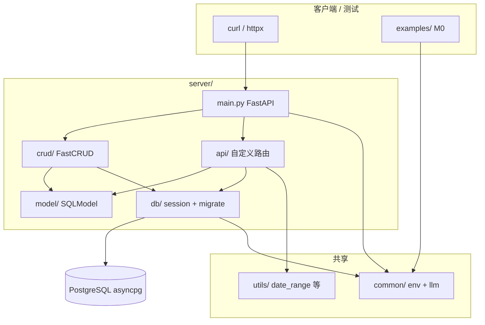
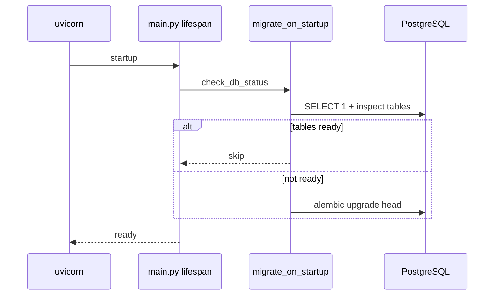

# 架构 — M1 现状

> 描述**当前代码**架构，非 `docs/learning-plan.md` 理想态。

## 总览

## 请求数据流

1. HTTP 请求进入 `server/main.py`
2. 请求日志中间件记录 method / path / status / 耗时
3. 标准 CRUD → `crud/routers.py` 的 FastCRUD 路由
4. 自定义查询 → `server/api/`（transactions 按月、summary 汇总）
5. `Depends(get_db)` 注入异步 session
6. SQLModel ORM 读写 PostgreSQL
7. `*Response` Pydantic 模型序列化 JSON

## 启动生命周期

## 错误处理

- `IntegrityError` → HTTP 409（unique / foreign key 区分文案）
- 数据库不可达 → 启动失败

## 与 Agent 层关系（M2+）

M0 已完成 LangChain 解析链（`examples/` + `common/llm/`）。M2 将把 `ParsedTransaction` 通过 Function Calling 写入 `server/` CRUD API。当前 M1 仅 REST，无 Agent 图。

## 相关文档

- [repo-layout.md](repo-layout.md) — 目录对照
- [server.md](server.md) — API 列表与启动
- [milestones.md](milestones.md) — 里程碑进度
