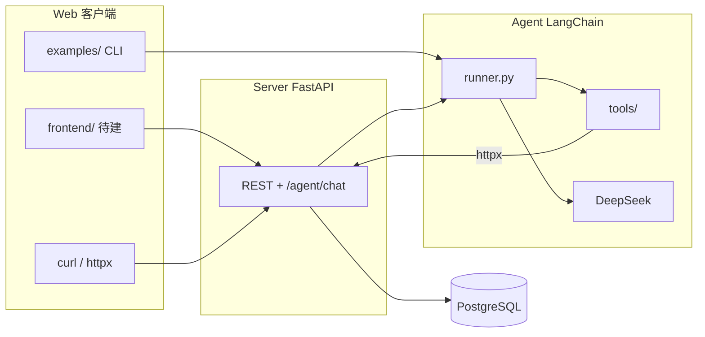

# 架构 — Web / Server / Agent / PostgreSQL

> BillMind **整体四层架构**（当前代码形态）。分层细节、API 列表、目录对照见 [server.md](server.md)、[repo-layout.md](repo-layout.md)。  
> **本文件由用户维护；Agent 不得修改。**

## 总览

## 四层职责

| 层 | 目录 | 职责 |
|----|------|------|
| **Web** | `frontend/`（待建）、`examples/`、HTTP 客户端 | 用户交互入口；CLI 可直接调 Agent，不经 Server 路由 |
| **Server** | `server/` | FastAPI 业务 API、Agent HTTP 入口（`/agent/chat`）、ORM 与数据库访问 |
| **Agent** | `agent/` | LLM 推理 + Function Calling 循环；工具通过 httpx 回调 Server，**不直连数据库** |
| **PostgreSQL** | `docker-compose.yml` | 交易、分类、预算等持久化存储 |

## 两条典型路径

**路径 A — Agent 记账 / 查账**

1. 用户输入自然语言（CLI 或 `POST /agent/chat`）
2. `agent/runner.py` 绑定工具并调用 LLM
3. LLM 输出 `tool_calls` → `agent/tools/` 执行 → httpx 请求 Server REST API
4. 工具结果回传 LLM → 生成自然语言回复

**路径 B — 直接 REST**

1. 客户端 `GET/POST` Server API（如 `/transactions`）
2. Server CRUD / 自定义路由 → SQLModel → PostgreSQL
3. 不经过 Agent

## 共享模块

- `common/` — 环境变量、LLM 客户端（Server 与 Agent 共用配置）
- `utils/` — 非 API 工具函数（如日期范围）

## 相关文档

- [server.md](server.md) — 启动、API、中间件、错误处理
- [repo-layout.md](repo-layout.md) — 目录对照 learning-plan
- [milestones.md](milestones.md) — 里程碑进度
