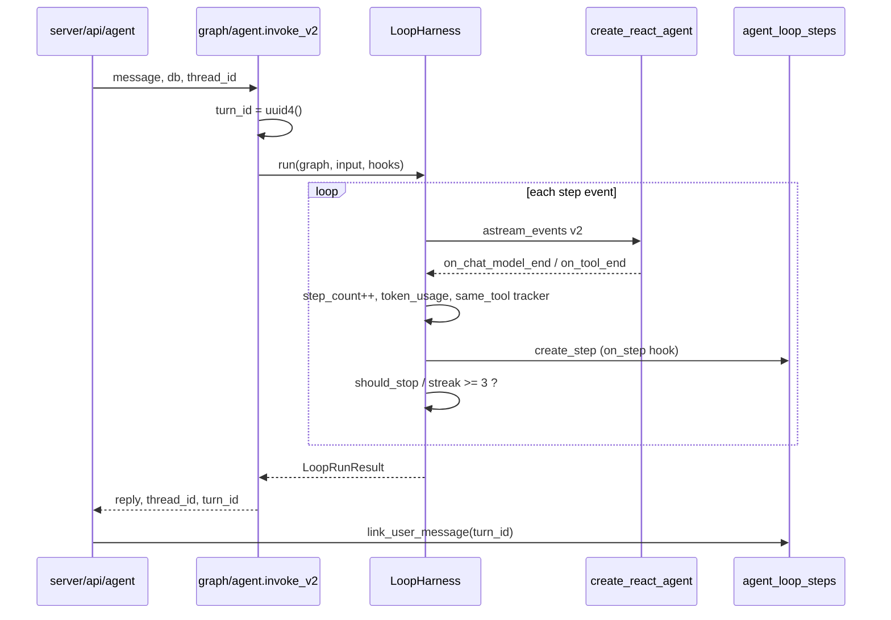

# Loop Engineering — 本质与 BillMind 实现

> 里程碑：**M10** · 代码入口：`agent/loop/`、`agent/graph/agent.py`（`invoke_v2`）

## 一句话本质

**Loop Engineering = 在 LangGraph ReAct 循环外包一层 Harness，用事件流监控每一步、硬/软限制防死循环，并把步级指标落库供观测与后续 Eval。**

图拓扑不变（仍是 `create_react_agent`）；Harness 通过 `astream_events(version="v2")` 旁路采集，不替换 `ainvoke`。

---

## 常见误解 vs 本质

| 误解 | 本质 |
|------|------|
| 要改 graph 节点才能限制循环 | **策略在 Harness + config**：`recursion_limit`、钩子、`same_tool_streak` |
| `invoke` 和 `invoke_v2` 必须二选一删掉 | **双路径并存**：`invoke()` 保留 M4 基线；生产 HTTP 默认 `invoke_v2()` |
| 软限制只靠 system prompt | Prompt 引导模型；**Harness 用 streak 强制执行**，避免模型无视规则 |
| `thread_id` 等于 `turn_id` | `thread_id` 标识多轮会话；`turn_id` 标识单次 `/agent/chat` invoke |

---

## 核心流程

### Step 1 — 硬限制

`policy.RECURSION_LIMIT = 15` 注入 `config["recursion_limit"]`；`LoopHooks.should_stop` 默认在 `step_count >= 15` 时中断。

### Step 2 — 软限制（同工具无结果）

连续 3 次调用同一工具且返回为空 / `{}` / 含 `error` 的 JSON → 中断并回复「我搞不定」。

### Step 3 — 步级落库

每步 `on_step` 写入 `agent_loop_steps`：`step_count`、`token_usage`、`node_name`、`tool_name`。

---

## 关键概念

| 术语 | 含义 |
|------|------|
| `invoke()` | M4 基线：`ainvoke`，`recursion_limit = MAX_TOOL_ROUNDS*2+1`，不落 loop 表 |
| `invoke_v2()` | M10：`LoopHarness.run` + `astream_events`，落库 + 结构化日志 |
| `turn_id` | 单次 HTTP invoke 的 UUID，关联一组 loop steps |
| `LoopHooks` | `on_step`（观测/落库）、`should_stop`（自定义超轮次停止） |
| `same_tool_streak` | 同一工具连续「无结果」计数，Harness 兜底 |

---

## invoke vs invoke_v2 对照

| 维度 | `invoke()` | `invoke_v2()` |
|------|------------|---------------|
| 执行 API | `graph.ainvoke` | `graph.astream_events` v2 |
| `recursion_limit` | 11（5 轮工具 × 2 + 1） | 15（`policy.RECURSION_LIMIT`） |
| 步级落库 | 否 | 是 → `agent_loop_steps` |
| 同工具 streak 兜底 | 否 | 是 |
| 生产 HTTP | 可回滚对照 | **默认** `POST /agent/chat` |

---

## BillMind 代码对照表

| 步骤 | 文件 / 符号 |
|------|-------------|
| 策略常量 | `agent/loop/policy.py` |
| 事件循环核心 | `agent/loop/harness.py` → `LoopHarness.run` |
| System prompt 软规则 | `agent/loop/prompt.py` → `LOOP_ENGINEERING_RULES` |
| v2 入口 | `agent/graph/agent.py` → `Agent.invoke_v2` |
| HTTP 接线 | `server/api/agent.py` → `invoke_v2` + `link_user_message` |
| 步级表 | `server/model/agent_loop_step.py` |
| 迁移 | `server/alembic/versions/004_agent_loop_steps.py` |
| 服务 | `storage/postgres/service/agent_loop_step.py` |

---

## 常见误区

1. **在 `build_agent_graph` 里改 recursion_limit** — v1/v2 应独立；v2 只用 `policy.RECURSION_LIMIT`。
2. **只靠 prompt 防死循环** — 必须保留 Harness `same_tool_streak` 与 `GraphRecursionError` 捕获。
3. **用 `thread_id` 关联 steps** — 落库用 `turn_id`；`thread_id` 用于会话维度查询。

---

## 官方文档

- [LangGraph streaming / astream_events](https://langchain-ai.github.io/langgraph/how-tos/streaming/)
- [LangGraph recursion_limit](https://langchain-ai.github.io/langgraph/troubleshooting/errors/GRAPH_RECURSION_LIMIT/)

---

## 里程碑与延伸阅读

- 课表：[docs/learning-plan.md](../learning-plan.md) M10
- 进度：[.harness/Wiki/milestones.md](../../.harness/Wiki/milestones.md)
- 对照 M4 LangGraph：[M4-langgraph.md](M4-langgraph.md)
- 对照 M9 Memory：[M9-memory-os.md](M9-memory-os.md)
