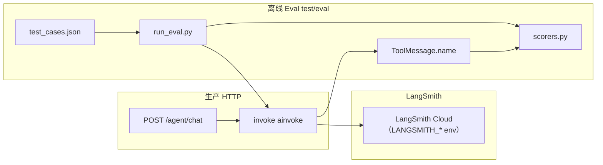

# Eval + LangSmith — 本质与 BillMind 实现

> 里程碑：**M11** · 代码入口：`test/eval/`、`common/env.py`、`agent/graph/agent.py`（`invoke`）

## 一句话本质

**Eval + LangSmith = 生产路径用 LangSmith 自动 trace 全链路；离线用 JSON 测试集 + `agent_loop_steps` 工具链 + 回复规则打分，不依赖 LangSmith 云端 Dataset。**

---

## 常见误解 vs 本质

| 误解 | 本质 |
|------|------|
| Eval 必须接 LangSmith 云端 Dataset | BillMind **离线 Eval** 在 `test/eval/`，只读本地 DB 步级表 |
| 要改 LangGraph 拓扑才能 trace | **`LANGSMITH_TRACING=true`** 时 LangGraph `ainvoke` / `astream_events` 自动上报，无需 `@traceable` 包装 |
| 必须新增 invoke_v3 才能 trace | **HTTP / Eval 用 `invoke()`**；LangSmith 与 `invoke_v2` Loop Harness 分离 |
| 工具评分靠解析 LLM 文本 | **读 graph `ToolMessage.name`**（Eval 用 `return_tools=True`） |

---

## 核心流程

### Step 1 — LangSmith 环境

启动时 `configure_langsmith()`（`server/main.py`）将 `.env` 中 `LANGSMITH_*` 同步到进程环境。开启 `LANGSMITH_TRACING=true` 并配置 APAC endpoint + API Key 后，LangGraph 调用自动出现在 LangSmith 项目。

### Step 2 — 生产走 invoke

HTTP 与 Eval 使用 `Agent.invoke()`（`ainvoke`），与 LangSmith 自动 trace 兼容。M10 的 `invoke_v2`（`astream_events` Loop Harness）保留，供步级落库场景单独调用。

### Step 3 — 离线 Eval

`run_eval.py` 加载 `test_cases.json`，`invoke(..., return_tools=True)` 从 graph messages 提取工具链并打分。

---

## 关键概念

| 概念 | 说明 |
|------|------|
| `configure_langsmith()` | 读取 `LANGSMITH_TRACING` / `ENDPOINT` / `API_KEY` / `PROJECT` |
| `invoke()` | 生产 HTTP + Eval；LangGraph trace 随 env 自动开启 |
| `score_tools` | 比较 `actual_tools` 与 `expected_tools`（all / any / sequence / none） |
| `score_reply_keywords` | 回复须含关键词（大小写 / 空白不敏感） |
| `score_llm_judge` | 可选 LLM-as-judge（`--llm-judge`） |

---

## 与相邻技术对比

| 维度 | M10 Loop Engineering | M11 Eval + LangSmith |
|------|----------------------|----------------------|
| 目标 | 步级监控 + 防死循环 | 可观测性 + 质量回归 |
| 数据 | `agent_loop_steps` 落库 | 复用同表做工具链断言 |
| 入口 | `invoke_v2` | 同左 + LangSmith env |
| 离线脚本 | 无 | `test/eval/run_eval.py` |

---

## BillMind 代码对照表

| 步骤 / 概念 | 文件 / 函数 | 说明 |
|-------------|-------------|------|
| LangSmith 配置 | `common/env.py` → `configure_langsmith` | 启动同步 env |
| 生产入口 | `agent/graph/agent.py` → `invoke` | `ainvoke`；Eval 可选 `return_tools=True` |
| HTTP 接线 | `server/api/agent.py` | 直接 `invoke` |
| 打分器 | `test/eval/scorers.py` | 工具 + 关键词 + 可选 judge |
| 评测 CLI | `test/eval/run_eval.py` | 读 `test_cases.json` + loop steps |
| 用例集 | `test/eval/test_cases.json` | 20 条离线用例 |
| 步级表 | `storage/postgres/service/agent_loop_step.py` | 仅 `invoke_v2` 路径落库 |

---

## 常见误区

1. **Eval 仍走 `invoke_v2` 读 loop 表** — HTTP 已切 `invoke()`；Eval 从 `ToolMessage` 取工具名。
2. **以为必须 `@traceable` 包装** — 配置 `LANGSMITH_*` 后 LangGraph 已自动 trace；勿与 `invoke_v2` 的 `astream_events` 双轨 trace。
3. **工具评分要求严格顺序** — 默认 `tool_match=all` 只要求集合包含；顺序用 `sequence` 模式。

---

## 官方文档

- [LangSmith Quickstart](https://docs.smith.langchain.com/)
- [LangSmith tracing with LangGraph](https://docs.smith.langchain.com/observability/how_to_guides/tracing/trace_with_langgraph)

---

## 里程碑与延伸阅读

- 课表：[docs/learning-plan.md](../learning-plan.md)
- 进度：[.harness/Wiki/milestones.md](../../.harness/Wiki/milestones.md)
- 对照 M10 Loop：[M10-loop-engineering.md](M10-loop-engineering.md)
- 索引：[docs/knowledge/README.md](README.md)
