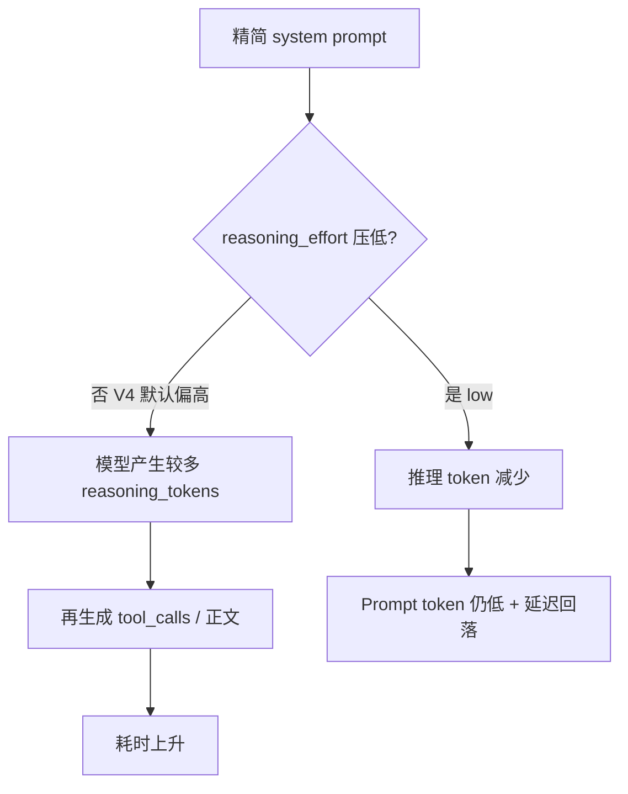

# 精简 System Prompt 后反而变慢 — Reasoning 模式

> 里程碑：**M11.1** · 关联：[M11.2-agent-optimization.md](M11.2-agent-optimization.md) · 代码入口：`common/llm/openai_chat_llm.py`、`agent/agent/promt/system_not_tools.py`

## 一句话本质

**Input token 下降 ≠ 延迟下降。** DeepSeek-V4-Flash 默认开启 **Thinking（推理）**；精简 system prompt 后若未显式关闭，模型会额外生成 `reasoning_tokens`，用户不可见但显著拉长耗时。

---

## 常见误解 vs 本质

| 误解 | 本质 |
|------|------|
| Prompt 变短，单次 LLM 一定更快 | 输出侧可能多出 **reasoning_tokens**，生成速度远慢于普通 completion |
| `reasoning_tokens` 会显示给用户 | 内部 CoT，不进最终 `content`，但计入 `completion_tokens` 与耗时 |
| 用 `thinking: disabled` 直接关推理 | OpenAI SDK 会报 `unexpected keyword argument 'thinking'`；BillMind 用 **`model_kwargs.reasoning_effort: low`** 压低推理 |
| 精简 prompt 方向错了 | ✅ 方向对；需 **压低 reasoning_effort** + **prompt 补「直接回答」** 双保险 |

---

## 现象（LangSmith Trace 对照）

| 指标 | 优化前 | 精简 prompt 后 | 说明 |
|------|--------|----------------|------|
| Prompt Token | ~4,700 | ~3,900 | ✅ 减少 |
| 输出 Token | ~120 | ~237 | ❌ 含 ~119 `reasoning_tokens` |
| 总耗时 | ~2.7s | ~7.1s | ❌ 约 2.6× |

关键证据（`completion_tokens_details`）：

```json
"completion_tokens_details": {
  "reasoning_tokens": 119
}
```

优化前 trace **无** `reasoning_tokens`；精简后首次出现，与耗时跳变时间点一致。

---

## 核心流程



### 为什么会触发 Thinking？

| 因素 | 说明 |
|------|------|
| **V4 默认** | `deepseek-v4-flash` 未传 `thinking` 时 **默认 thinking enabled** |
| Prompt 变短 | 删去「用简洁中文说明结果」等**直接作答**指令，模型更倾向先「想一遍」 |
| 触发词（次要） | 「分析」「逐步」等词可能加强推理倾向；BillMind 精简版已尽量避免 |
| 用户问法（次要） | 「为什么」「怎么」类问题；记账场景相对少见 |

---

## BillMind 代码对照与修复

| 层级 | 文件 | 做法 |
|------|------|------|
| **P0 API** | `common/llm/openai_chat_llm.py` | DeepSeek：`model_kwargs={"reasoning_effort": "low"}`（可配置 `DEEPSEEK_REASONING_EFFORT`） |
| **P1 Prompt** | `agent/agent/promt/system_not_tools.py` | 保留「工具 JSON 后简洁中文说明」+ **不要展示推理过程** |
| 观测 | LangSmith | 看 `reasoning_tokens` / `reasoning_content` 是否归零 |
| 完整 prompt 对照 | `agent/agent/promt/system.py` | 未改；含工具枚举的旧版，仅作对照 |

### 方案一：压低 reasoning_effort（推荐，已实现）

```python
# common/llm/openai_chat_llm.py — DeepSeek Agent 路径
kwargs["model_kwargs"] = {"reasoning_effort": "low"}  # 可选 low / medium / high
```

配置：`config.yaml` → `deepseek_reasoning_effort: low`（默认）。设 `none` 则不传该参数。
旧键 `deepseek_thinking_disabled: true` 仍兼容，等价于 `low`。

### 方案二：Prompt 抑制推理（已实现，作双保险）

```text
- 工具返回 JSON 后，用简洁中文向用户说明处理结果
- 直接回答用户问题，不要展示推理过程，不要输出思考内容
```

### 方案三：恢复部分旧版直接指令

与方案二等价；不必恢复整段工具枚举。

---

## 实测记录区

| 场景 | Prompt Token | reasoning_tokens | 耗时 | 备注 |
|------|--------------|------------------|------|------|
| 精简前 | ~4,700 | 0 | ~2.7s | 基线 |
| 精简后（未关 thinking） | ~3,900 | ~119 | ~7.1s | 本文问题 |
| 精简 + reasoning_effort low | ~3,900 | 待测 | ~2–3s（待填） | 改后复测 |

---

## 排查清单

1. LangSmith 打开慢 trace → `usage.completion_tokens_details.reasoning_tokens`
2. 若有 `reasoning_content`，展开看模型在「想什么」
3. 确认请求体含 `reasoning_effort: low`（或 env 已配置）
4. 对比同一条 user message 优化前/后/关 thinking 三次耗时

---

## 常见误区

1. **只盯 input token** — Agent 延迟 = input + **output（含 reasoning）** + 轮次。
2. **误以为 Flash = 一定非推理** — V4-Flash 默认 thinking；Flash 指的是模型规模/路由，不是「无 CoT」。
3. **Multi-turn tool 后再开 thinking** — 若曾开 thinking，后续 turn 需按 API 要求回传 `reasoning_content`；Agent 路径统一 disabled 最省事。

---

## 官方文档

- [DeepSeek API — V4 / Thinking](https://api-docs.deepseek.com/)
- [LangChain ChatOpenAI — model_kwargs vs extra_body](https://python.langchain.com/docs/integrations/chat/openai/)

---

## 延伸阅读

- Token 与通道分工：[M11.2-agent-optimization.md](M11.2-agent-optimization.md)
- Eval / Trace：[M11-eval-langsmith.md](M11-eval-langsmith.md)
- 索引：[docs/knowledge/README.md](README.md)
