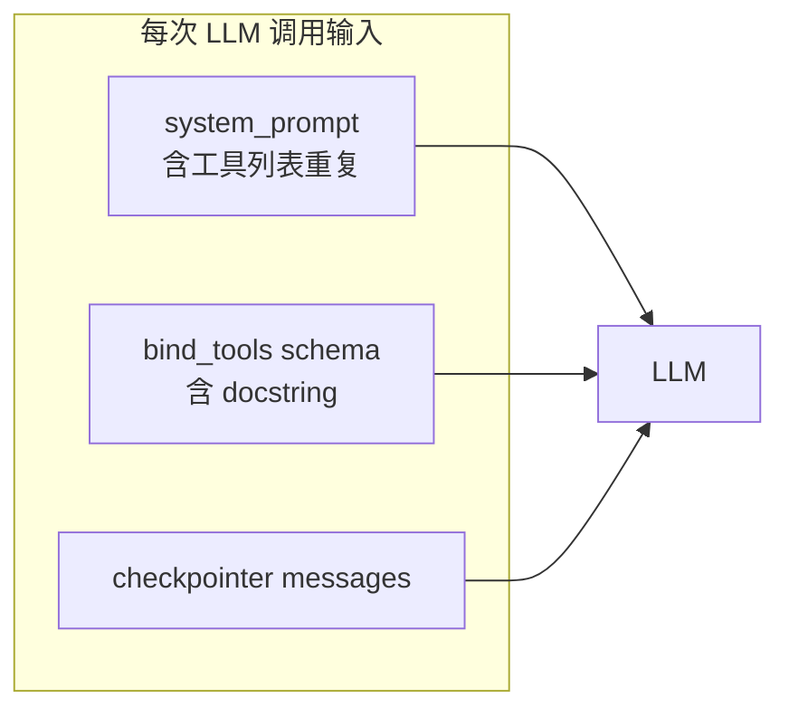
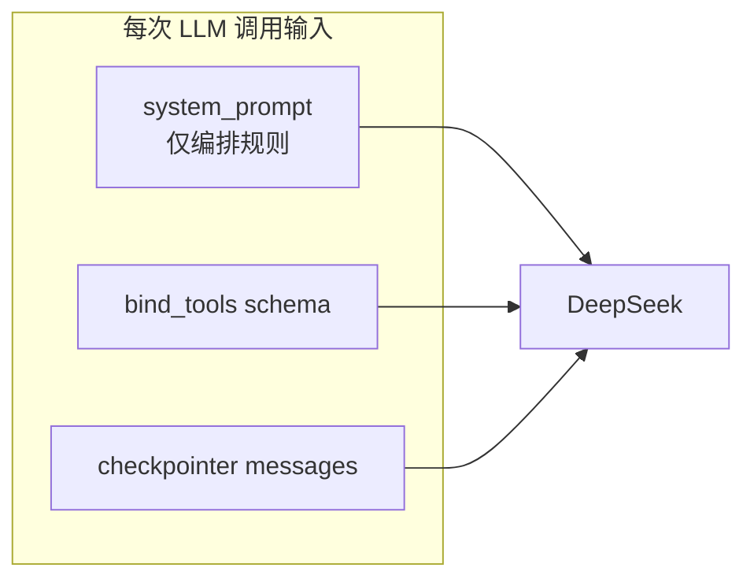

# Agent 延迟与成本优化 — 本质与 BillMind 实现

> 归类：**性能 / 成本** · 代码入口：`agent/agent/promt/system.py`、`common/llm/setting.py`、`storage/working/checkpointer.py`

## 一句话本质

**Agent 端到端延迟 ≈ 每次 LLM 调用的输入 token × ReAct 轮次 + checkpointer 读写 I/O + 阻塞 HTTP 等待；成本与延迟同源，首要是削减重复进模型的文本。**

---

## 常见误解 vs 本质

| 误解 | 本质 |
|------|------|
| 工具说明必须写进 system prompt，模型才认得工具 | **`bind_tools` 已把 name + docstring 注入 schema**；system prompt 只需 schema 无法表达的编排规则（时间路由、意图分流、附件协议） |
| `deepseek-chat` 是长期稳定的模型 ID | 官方将路由到 V4-Flash，但 **2026-07-24 后 legacy ID 退役**；应显式配置 `deepseek-v4-flash` |
| 换成 `AsyncPostgresSaver` 就能少写 checkpoint | **Async ≠ 少写入**；每 ReAct 步仍写 msgpack 快照，只是不阻塞 event loop |
| 流式输出能直接降 token 成本 | SSE **改善首字延迟与 UX**，不改变每轮 LLM 输入体量；token 优化靠 prompt 与轮次 |
| `tools` 和 `messages` 是一回事，写进 SystemMessage 模型才看得见 | **两条独立 API 参数**：`tools` 传 JSON Schema，`messages` 传对话；互不占用对方计费口径 |

---

## Tools 与 messages：两条 API 通道

OpenAI 兼容 Chat Completions（DeepSeek 同理）每次请求体里，**工具定义**与**对话历史**是分开传的。BillMind 里 `create_react_agent` → `bind_tools` 走 `tools` 参数；`system_prompt()` 生成的是 `messages[0]` 的 `SystemMessage` 正文。

```text
┌─────────────────────────────────────────────────────────────────┐
│                        请求发给 DeepSeek API                    │
├─────────────────────────────────────────────────────────────────┤
│  tools: [                                                      │ ← 初始化时绑定，每次自动带
│    { name: "get_daily_summary", schema: {...} },               │   不占用 messages token
│    { name: "query_transactions", schema: {...} },              │   模型通过 API 参数感知
│    ...                                                         │
│  ]                                                             │
├─────────────────────────────────────────────────────────────────┤
│  messages: [                                                   │ ← 每次请求传输
│    SystemMessage: "你是 BillMind 记账助手。今天日期：..."      │   可精简到 ~300 tokens
│    HumanMessage: "今天的消费明细"                              │
│    AIMessage: {...}                                            │
│    ToolMessage: {...}                                          │
│  ]                                                             │
└─────────────────────────────────────────────────────────────────┘
```

**Tools 定义（JSON Schema）和 System Prompt（自然语言）是两条不同的通道，互不干扰。**

| 通道 | BillMind 来源 | 应放什么 | 不应放什么 |
|------|---------------|----------|------------|
| `tools` | `@tool` docstring + 类型注解 → `bind_tools` | 函数名、参数 schema、工具级说明 | 时间路由、意图分流等编排规则 |
| `messages` | `system_prompt(tools)` + checkpointer 历史 | 角色、日期、编排规则、附件协议 | 再抄一遍工具 name/摘要（与 schema 重复） |

因此 P1 精简 system prompt 不会削弱选型能力：模型仍从 `tools` 读取 `get_daily_summary` 等定义；system prompt 只补 schema 表达不了的「用户说今天 → 必须调哪个工具」。

Function Calling 四步流程见 [M2-function-calling.md](M2-function-calling.md)；本节只强调 **HTTP 请求层的分工**，是理解 token 优化的前提。

---

## 核心流程

### 优化前：invoke 输入构成



### 优化后：职责分离



---

## 四项优化对照表

| 方案 | 预期收益 | BillMind 落点 | 状态 |
|------|----------|---------------|------|
| P1 精简 system prompt | 每轮少数百～上千 input token | `agent/agent/promt/system.py` — 删除 `_format_tools_section`，压缩规则 | **done** |
| P2 SSE 流式输出 | 首字延迟 ↓，UX ↑ | `POST /agent/chat/stream` + `astream_events` + 前端增量 append | **deferred**（Phase 2） |
| P3 checkpointer 池 / 减写入 | 连接争抢 ↓；减写入需自定义图 | `storage/working/checkpointer.py` — `CHECKPOINTER_POOL_MAX`；减写入见 §待办 | **partial** |
| P4 DeepSeek 模型可配置 | 默认 Flash，路由可控 | `common/env.py` → `get_deepseek_model()`，`common/llm/setting.py` | **done** |

---

## BillMind 代码对照表

| 步骤 / 概念 | 文件 / 函数 | 说明 |
|-------------|-------------|------|
| System prompt 生成 | `agent/agent/promt/system.py` — `system_prompt()` | 编排规则 + `LOOP_ENGINEERING_RULES`；工具枚举已移除 |
| 工具 schema | `agent/graph/graph.py` — `create_react_agent(..., tools)` | `bind_tools` 携带 `@tool` docstring |
| Checkpointer | `storage/working/checkpointer.py` — `init_checkpointer()` | `AsyncPostgresSaver` + 可配置 `max_size` |
| LLM 模型 ID | `common/llm/setting.py` — `DEEPSEEK_MODEL` | 默认 `deepseek-v4-flash`，`config.yaml` 可覆盖 |
| HTTP 入口 | `server/api/agent.py` — `POST /agent/chat` | 仍 `Agent.invoke()` 阻塞 JSON；Eval 同路径 |

---

## 实测记录区

| 指标 | 改前 | 改后 | 备注 |
|------|------|------|------|
| `system_prompt` 字符数（代表性 tool 列表） | — | — | 跑 `pytest agent/agent/promt/system_test.py` |
| 单次 `/agent/chat` P50 延迟 | — | — | 待填 |
| 单次 invoke input tokens（LangSmith） | — | — | 待填 |

---

## 常见误区

1. **双写工具描述** — system prompt 再抄 `@tool` 摘要只会放大 token，不提高选型准确率。
2. **改 AsyncSaver 期望少 checkpoint 行** — LangGraph prebuilt ReAct 每步默认 checkpoint；要减写入需自定义 StateGraph 或归档策略（见 [architecture-decisions.md](../architecture-decisions.md) §3.12/§3.13）。
3. **Eval 与生产共用模型 / Key** — 压测 Eval 会抢 DeepSeek 配额，应隔离（§3.3 / §3.8）。

---

## 待办（Phase 2+）

- **SSE 流式**：`POST /agent/chat/stream` + `StreamingResponse` + `on_chat_model_stream` 过滤；前端 `web/src/api/agent.ts`、`ChatPage.tsx` 增量渲染；保留 JSON `/agent/chat` 供 Eval。
- **Checkpoint 减写入**：自定义图或 thread 归档；与上下文截断、新开会话联动。
- **多 Key / Eval 隔离**：见 [architecture-decisions.md](../architecture-decisions.md) §3.3、§3.8。
- **LLM 并发信号量**：§3.1，与 B1/B2 瓶颈一并治理。

---

## 官方文档

- [DeepSeek API — Models](https://api-docs.deepseek.com/)
- [LangGraph — Checkpoints](https://langchain-ai.github.io/langgraph/concepts/persistence/)
- [LangGraph — Streaming](https://langchain-ai.github.io/langgraph/how-tos/streaming/)

---

## 延伸阅读

- 架构决策与瓶颈：[docs/architecture-decisions.md](../architecture-decisions.md)
- Loop 软限制：[M10-loop-engineering.md](M10-loop-engineering.md)
- 知识点索引：[docs/knowledge/README.md](README.md)
