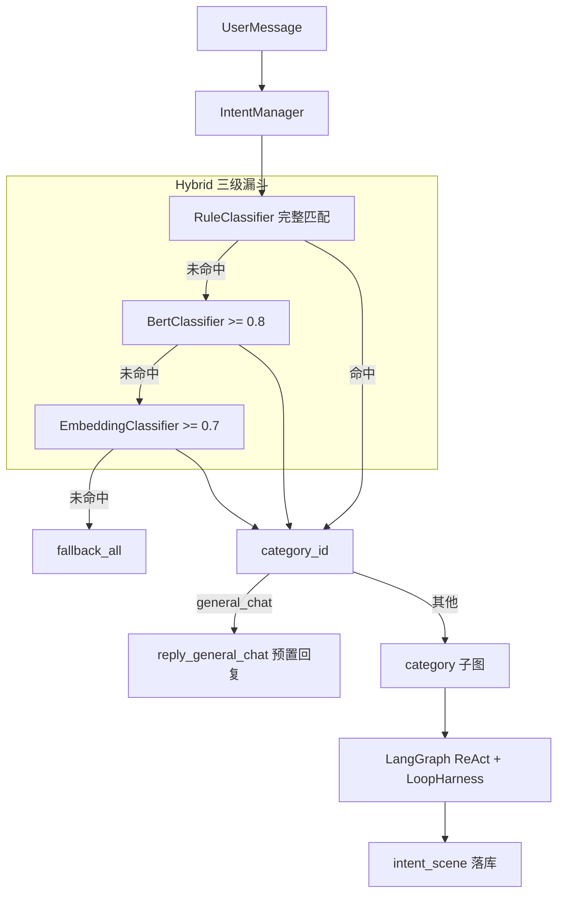

# M12 前置意图识别

## 一句话本质

在 LangGraph ReAct 循环**之前**，用轻量分类器把用户消息路由到 **skill category → 工具子集**，避免每次 `bind_tools` 全量 schema；`general_chat` 直调预置回复、零 LLM token。

## 两层架构

| 层 | 目录 | 职责 |
|----|------|------|
| Skill 分类 | `agent/common/` + skills/mcp | 4 类：`mcp_gaode` / `rag_knowledge` / `transaction` / `general_chat` |
| 意图查询 | `agent/intent/IntentManager` | Rule → BERT → Embedding 四级漏斗 |

## 核心流程



## 关键概念

| 术语 | 说明 |
|------|------|
| `category_id` | Skill 分类：`mcp_gaode` / `rag_knowledge` / `transaction` / `general_chat` |
| `SkillRegistry` | 统一注册 skill 包与 tools 的单例 |
| `HybridFunnel` | Rule → **BERT** → Embedding 顺序尝试（BERT 在 Embedding 前） |
| `general_chat` | 普通 skill 分类；命中后直调 `reply_general_chat`，不编译子图 |
| `fallback_all` | 全量 tools，与 M11 行为一致 |

## 三种分类器实现对比

生产环境固定走 **Hybrid 漏斗**（Rule → BERT → Embedding），前一级未命中才进入下一级；不再通过 `intent_classifier` 配置切换单路。

| 维度 | Rule | BERT | Embedding |
|------|------|------|-----------|
| **实现文件** | `agent/intent/classifiers/rule.py` | `agent/intent/classifiers/bert.py` | `agent/intent/classifiers/embedding.py` |
| **核心算法** | 关键词边界匹配 + 正则 `fullmatch` | 文本分类（序列标注） | 向量余弦相似度 Top-1 |
| **特征来源** | `register_skill_category(keywords=..., patterns=...)` 写入 `SkillRegistry` | 用户句子的字符 n-gram 特征（sklearn） | 各 category 的 `description` 预计算向量 vs 用户句向量 |
| **推理输入** | 原始用户文本 | 原始用户文本 | 原始用户文本 → Ollama `embed_query` |
| **命中条件** | 关键词整句/边界匹配，或正则完整匹配 | `predict_proba` / `softmax` 最高分 ≥ 阈值 | 与 4 类 description 余弦相似度最高 ≥ 阈值 |
| **默认阈值** | 无（命中即 `confidence=1.0`） | `intent_bert_threshold` = **0.8** | `intent_embedding_threshold` = **0.7** |
| **返回 method** | `"rule"` | `"bert"` | `"embedding"` |
| **运行时依赖** | 无（纯 Python `re`） | `joblib` 加载 `sklearn_pipeline.joblib` | `langchain_ollama.OllamaEmbeddings`（需 Ollama 服务） |
| **离线训练** | 无需训练，改关键词/正则即可 | `scripts/train_intent_classifier.py` | 无需训练，改 category `description` 即可 |
| **训练数据** | — | `test/eval/intent_cases.json`（`expected_category`）+ 可选 `test_cases.json` 增强 | — |
| **模型产物** | — | `agent/intent/classifiers/sklearn_pipeline.joblib`（与 `bert.sh` 同目录） | — |
| **速度** | 最快（内存字典 + 正则） | 快（本地 sklearn 推理） | 较慢（每次请求调 Ollama API） |
| **可解释性** | 高（命中哪条 keyword/pattern 可查） | 中（输出 top-k 概率） | 中（输出各类余弦分） |
| **典型适用** | 固定话术、强规则场景（「记一笔」「本月花了多少」） | 表述多样、需泛化的短句分类 | 语义相近但字面不同的说法；Rule/BERT 未覆盖时长尾 |

### Rule — 关键词 + 正则

1. `prepare()`：从 `SkillRegistry` 读取 4 类 `keywords` / `patterns`，编译正则。
2. `classify(text)`：按 `all_categories()` 顺序遍历；任一 keyword 边界匹配或 pattern `fullmatch` → 立即返回 `confidence=1.0`。
3. 调参：改各 skill / MCP 模块顶层的 `register_skill_category(keywords=..., patterns=...)`（`@tool_register(user_triggers=...)` 仅用于 system prompt，不参与 Rule 匹配）。

### BERT — sklearn（Tfidf + LogisticRegression）

BillMind 使用轻量 sklearn 分类器（无需 GPU / torch）：

```text
TfidfVectorizer(char, 1-3 gram) → LogisticRegression(4-class) → predict_proba
```

1. **训练**（`scripts/train_intent_classifier.py` 或 `./agent/intent/classifiers/bert.sh`）：
   - 读取 `intent_cases.json` 的 `(message, expected_category)`；
   - 输出 `agent/intent/classifiers/sklearn_pipeline.joblib`。
2. **推理**（`BertClassifier.prepare()`）：
   - 加载同目录 `sklearn_pipeline.joblib`；
   - `predict_proba` 取 top-k，最高分 ≥ `intent_bert_threshold` 才命中。

### Embedding — Ollama 向量相似度

1. `prepare()`：对 4 类 `SkillCategoryDef.description` 各调一次 `embed_query`，缓存 category 向量。
2. `classify(text)`：用户句 embed 后与 4 类向量算余弦相似度，Top-1 ≥ `intent_embedding_threshold`（0.7）才命中。
3. 调参：扩充 `register_skill_category(description=...)` 的语义描述；依赖 `ollama_uri` / `ollama_embedding_model` 配置。

## BillMind 代码对照表

| 步骤 | 路径 |
|------|------|
| 分类注册 | `register_skill_category()` in skill modules |
| 统一 Registry | `agent/common/skill_registry.py` |
| 意图入口 | `agent/intent/manager.py` → `intent_manager.classify()` |
| Hybrid 漏斗 | `agent/intent/classifiers/hybrid.py` |
| Rule / BERT / Embedding | `agent/intent/classifiers/*.py` |
| 子图编译 | `agent/graph/agent.py` → `Agent.init()` |
| general_chat 执行 | `invoke_v2` 直调 `reply_general_chat` |
| 离线评测 | `test/eval/run_intent_eval.py`（`expected_category`） |
| BERT 训练 | `scripts/train_intent_classifier.py`（4-label） |

## 调参指南

- 生产漏斗固定：**Rule → BERT → Embedding**，三级均未命中 → `fallback_all`
- `intent_bert_threshold`：默认 **0.8**（第二级）
- `intent_embedding_threshold`：默认 **0.7**（第三级）
- Rule：扩充 `register_skill_category` 的 `keywords` / `patterns`
- BERT：扩充 `intent_cases.json` → 重跑 `scripts/train_intent_classifier.py` 或 `bert.sh`
- Embedding：改写各 category 的 `description` 语义描述

## 里程碑与延伸阅读

- 交付单：[`.harness/Changes/M12_1-intent-recognition.plan`](../../.harness/Changes/M12_1-intent-recognition.plan)
- 分类器详解：[agent/intent/classifiers/README.md](../../agent/intent/classifiers/README.md)
- 索引：[docs/knowledge/README.md](README.md)
