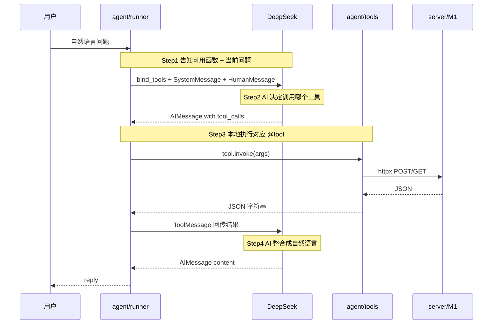

# Function Calling — 本质与 BillMind 实现

> 里程碑：**M2** · 代码入口：`agent/runner.py`、`agent/tools/db_tools.py`

## 一句话本质

**LLM 是「调度员」，Runner 是「执行器」，Tool 是「手脚」。**

模型只输出结构化调用意图（`tool_calls`），**不执行**任何网络 I/O 或数据库写入；本地 Runner 按名称查找 `@tool`、执行后把 JSON 结果喂回模型，模型再组织成用户可读的自然语言。

---

## 常见误解 vs 本质

| 误解 | 本质 |
|------|------|
| LLM 直接调 API / 写数据库 | LLM **只输出结构化意图**（`tool_calls`），**不执行**任何 I/O |
| Function Calling = 普通函数调用 | 是 **人机协作循环**：推理（AI）与行动（本地 Runner）分离 |
| 一次 LLM 调用就够 | 往往是 **多轮**：选工具 → 观察结果 → 再推理 → 最终自然语言 |

---

## 四步核心流程



### Step 1 — 告知函数与问题

Runner 通过 `llm.bind_tools(tools)` 把每个 `@tool` 的 **name、description、JSON Schema** 注入模型上下文；同时用 `SystemMessage` 说明角色与规则，用 `HumanMessage` 携带用户问题。

```102:107:agent/runner.py
    llm = get_openai_chat_llm(
        provider=LLMProvider.DEEPSEEK,
        capability=LLMCapability.TEXT,
        temperature=0,
    ).bind_tools(tools)

    messages: list = [
        SystemMessage(content=_SYSTEM_PROMPT),
        HumanMessage(content=message),
    ]
```

工具定义在 `agent/tools/db_tools.py`：`@tool` 装饰器从函数名、docstring、类型注解自动生成 schema，供模型「选型」。

### Step 2 — AI 选择方法

模型返回 `AIMessage`，其中可能含 `tool_calls`（函数名 + 参数），**不是**最终给用户的答案。

```112:125:agent/runner.py
    for round_idx in range(MAX_TOOL_ROUNDS):
        response = llm.invoke(messages)
        ...
        messages.append(response)

        if not response.tool_calls:
            content = response.content
            return content if isinstance(content, str) else str(content)
```

当 `tool_calls` 为空时，说明模型认为无需再调工具，直接返回 `content` 作为回复。

### Step 3 — 本地执行工具

`agent/function_calling.py` 按 `tool_call["name"]` 查表，调用 `tool.invoke(args)`，把返回值包装为 `ToolMessage` 追加到对话历史。

```15:37:agent/function_calling.py
def execute_tool_calls(
    ai_message: AIMessage,
    tools_map: dict[str, BaseTool],
    *,
    debug: bool = False,
) -> list[ToolMessage]:
    ...
        tool = tools_map.get(name)
        if tool is None:
            content = f'{{"error": true, "detail": "未知工具: {name}"}}'
        else:
            content = tool.invoke(args)
        ...
        tool_messages.append(ToolMessage(content=content, tool_call_id=tool_call_id))
```

工具层调用 ``server/service/transaction.py`` 读写 PostgreSQL：

```python
result = await transaction_service.create_transaction_from_agent(
    db, amount=amount, category=category, ...
)
```

### Step 4 — AI 整合回答

同一 `messages` 列表再次 `llm.invoke`：历史里已有用户的问、模型的 `tool_calls`、工具的 JSON 结果。模型基于**真实 API 返回**生成简洁中文总结，避免凭空编造金额或笔数。

---

## 关键概念

| 概念 | 说明 |
|------|------|
| `@tool` | LangChain 工具装饰器；docstring 与参数类型 → JSON Schema |
| `bind_tools` | 把工具 schema 绑定到 Chat 模型，启用 OpenAI 兼容 function calling |
| `tool_calls` | 模型输出的结构化调用列表：`name`、`args`、`id` |
| `ToolMessage` | 工具执行结果；`tool_call_id` 必须与对应 `tool_calls[i].id` 匹配 |
| `MAX_TOOL_ROUNDS` | 防止无限循环的上限（BillMind 设为 5） |

---

## 与 M0 对比

| 维度 | M0（`examples/00_hello_chain.py`） | M2（Function Calling） |
|------|--------------------------------------|-------------------------|
| 输出形态 | Prompt → LLM → **直接 JSON 文本** | LLM → **tool_calls** → 工具 → 再 LLM |
| 谁执行 I/O | 应用解析 JSON 后自行调 API | Runner + `@tool` 经 `server/service` 直连 PostgreSQL |
| 失败模式 | JSON 格式错、字段幻觉 | 工具层返回 error JSON，模型可据此解释 |
| 适用场景 | 学习 Chain、快速验证解析 | 生产 Agent：模型选型 + 本地执行分离 |

M2 把「理解」和「行动」拆开：模型负责**选哪个工具、填什么参数**；工具负责**可审计、可测试的 HTTP 调用**。

---

## BillMind 代码对照表

| 四步 | 文件 / 函数 | 消息 / 类型 |
|------|-------------|-------------|
| 1 告知 | `agent/runner.py` → `invoke_agent` | `SystemMessage`, `HumanMessage` |
| 2 选型 | `runner.py` 内 `llm.invoke` | `AIMessage.tool_calls` |
| 3 执行 | `agent/function_calling.py` → `execute_tool_calls`；`db_tools.py` + `server/service/` | `ToolMessage` |
| 4 整合 | `runner.py` 下一轮 `llm.invoke` | `AIMessage.content`（无 tool_calls） |

**入口（均调用同一 `invoke_agent()`）：**

| 入口 | 路径 |
|------|------|
| CLI | `examples/02_function_calling_agent.py` |
| HTTP | `POST /agent/chat` → `server/api/agent.py` |

HTTP 层不直接调 LLM，只做请求校验并转发给 Runner。

---

## 常见误区

1. **以为模型会写库** — 只有 `add_transaction.invoke(...)` 才会 `POST /transactions`；模型从未持有数据库连接。
2. **忽略 docstring 质量** — 模型靠 name + description 选型；模糊的 docstring 会导致错选 `query_transactions` vs `get_monthly_summary`。
3. **无限 tool 循环** — BillMind 用 `MAX_TOOL_ROUNDS = 5` 兜底；M4 LangGraph 会把循环拆成显式图节点与条件边。
4. **把 tool 返回当最终回复** — 用户看到的是 Step 4 的自然语言；中间 JSON 仅存在于 `ToolMessage`。

---

## 官方文档

- LangChain Tools：https://python.langchain.com/docs/concepts/tools/
- Function Calling 教程：https://python.langchain.com/docs/how_to/function_calling/

---

## 里程碑与延伸阅读

- 课表 M2 节：[docs/learning-plan.md](../learning-plan.md)（Day 3–4）
- 下一里程碑：M4 LangGraph 将把本文件的 for 循环拆成 `StateGraph` + `ToolNode`
- 索引：[docs/knowledge/README.md](README.md)
