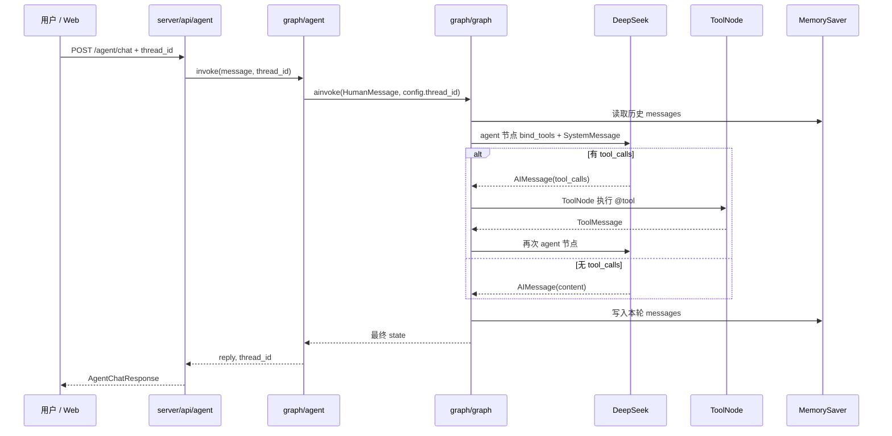

# LangGraph — 本质与 BillMind 实现

> 里程碑：**M4** · 代码入口：`graph/graph.py`、`graph/agent.py`（对照 M2：`agent/agent.py`）

## 一句话本质

**LangGraph = 把 M2 的「推理-行动」循环从隐式 for 循环提升为可观测、可持久化的状态图。**

图内节点仍用 LangChain 的 LLM、`bind_tools` 与 `ToolMessage`；LangGraph 负责**控制流**（agent → tools → agent）与**跨轮状态**（checkpointer + `thread_id`）。

---

## 常见误解 vs 本质

| 误解 | 本质 |
|------|------|
| 上了 LangGraph 就不用 LangChain | 图内 **agent 节点**仍用 LangChain Chat 模型 + `bind_tools`；ToolNode 包装 LangChain `@tool` |
| LangGraph 替代 Function Calling | Function Calling 仍是 **LLM 输出 tool_calls**；LangGraph 只编排「何时调 LLM、何时调 ToolNode」 |
| `thread_id` 等于数据库 session | `thread_id` 仅标识 **checkpointer 中的对话历史**；M4 用内存 `MemorySaver`，进程重启即丢失（M9 换 Postgres） |
| SystemMessage 应写入 checkpoint 每条 HumanMessage 前 | BillMind 在 **agent 节点调用 LLM 时 prepend**，不写入 state，避免 checkpoint 膨胀 |

---

## 核心流程



### Step 1 — 编译图（启动一次）

`Agent.init()` 扫描 skills、创建 `MemorySaver()`，调用 `build_agent_graph()` 得到 compiled graph。

### Step 2 — 每轮只输入 HumanMessage

`Agent.invoke` 不向图重复塞入 SystemMessage；历史由 checkpointer 按 `thread_id` 累积。

### Step 3 — agent 节点推理

对 LLM 调用前若 state 首条不是 `SystemMessage`，临时 prepend `system_prompt(tools)`。

### Step 4 — 条件边与 ToolNode

`tools_condition` 判断最后一条 `AIMessage` 是否含 `tool_calls`：有则走 `tools` 节点，否则 `END`。

---

## 关键概念

| 概念 | 说明 |
|------|------|
| `StateGraph` | 有向图；BillMind 使用 `MessagesState`（messages + `add_messages` reducer） |
| `ToolNode` | LangGraph 预置节点，批量执行 `tool_calls` 并产出 `ToolMessage` |
| `tools_condition` | 预置条件边：有 tool_calls → `"tools"`，否则 → `END` |
| `MemorySaver` | 进程内 checkpointer；按 `configurable.thread_id` 隔离会话 |
| `recursion_limit` | 图步数上限；BillMind 设为 `MAX_TOOL_ROUNDS * 2 + 1`（每轮 agent+tools 两步） |

---

## 与相邻技术对比

### LangChain（M0/M2） vs LangGraph（M4）

| 维度 | LangChain（M0/M2 够用） | LangGraph（M4 引入） |
|------|---------------------------|----------------------|
| 抽象 | LCEL Chain、`bind_tools` + 手写 for 循环 | 有状态 **StateGraph**：Node / Edge / 条件边 |
| 状态 | 每次 `invoke` 自行拼 `messages` 列表 | `MessagesState` + **checkpointer** 按 `thread_id` 持久化 |
| 控制流 | `MAX_TOOL_ROUNDS` 在 Python 里兜底 | `agent → tools → agent` 为**显式图**；`recursion_limit` 兜底 |
| 适用场景 | 单次链路、无跨轮记忆 | 多步工作流、跨轮引用（「刚才那笔…」）、后续 M8 月报图 |
| BillMind 落点 | `common/llm/`、`agent.Agent.parse_image`（视觉 Chain） | `graph/` + `MemorySaver` + `thread_id` |

M2 的 Function Calling **执行语义不变**；详见 [function-calling.md](function-calling.md)。

### M2 `agent/agent.py` vs M4 `graph/` — 核心代码差异

两边**共用** `agent/skills/`、`agent/promt/system.py`、`get_openai_chat_llm` + `bind_tools`；区别只在 **谁来管循环、谁来管历史**。仓库内并列两套实现，可用 `AGENT_BACKEND=agent|graph` 切换（默认 `graph`）。

| 维度 | M2 `agent/agent.py` | M4 `graph/` |
|------|---------------------|-------------|
| 循环 | `for` + `MAX_TOOL_ROUNDS` | `StateGraph` + `recursion_limit` |
| 执行 tool | `function_calling()` | `ToolNode` |
| 状态 | 函数内 `messages` 列表 | `MessagesState` + `MemorySaver` |
| 跨轮 | ❌ | ✅ `thread_id` |
| 学习重点 | Function Calling 四步循环 | 编排从隐式 for 变成显式图 |

#### 1. 初始化：只加载工具 vs 编译图 + 记忆

**M2** — `init()` 只扫描 skills，不建图：

```58:61:agent/agent.py
    def init(cls) -> None:
        """在 ``Database.init`` 之后调用，加载 skill 工具与 prompt 策略。"""
        discover_skill_modules(Database.get().async_session_factory)
        logger.info("agent skills loaded: %s", ", ".join(SKILL_TOOLS))
```

**M4** — `init()` 加载 skills 后创建 `MemorySaver` 并 `compile` 图（启动一次、进程内复用）：

```38:45:graph/agent.py
        discover_skill_modules(Database.get().async_session_factory)
        tools = list(SKILL_TOOLS.values())
        checkpointer = MemorySaver()
        _COMPILED_GRAPH, _RECURSION_LIMIT = build_agent_graph(
            tools,
            checkpointer,
            max_tool_rounds=MAX_TOOL_ROUNDS,
        )
```

**原因**：M2 每次 `invoke` 自行拼 `messages`，无跨轮状态。M4 要把 ReAct 循环编译成图，并用 checkpointer 按 `thread_id` 存历史，故在 `init` 时 compile。

#### 2. 每轮输入：拼全量 messages vs 只塞一条 HumanMessage

**M2** — 每次把 System + 当前用户话写入列表（仅本轮上下文）：

```99:102:agent/agent.py
        messages: list = [
            SystemMessage(content=system_prompt(tools)),
            HumanMessage(content=message),
        ]
```

**M4** — 只向图输入本轮 `HumanMessage`，历史由 checkpointer 按 `thread_id` 补全：

```70:72:graph/agent.py
        result = await _COMPILED_GRAPH.ainvoke(
            {"messages": [HumanMessage(content=message)]},
            config=config,
```

**原因**：M2 无跨轮记忆，每次 `invoke` 独立。M4 同 `thread_id` 的上一轮已在 checkpoint 里，不必由调用方重复传 history。

#### 3. 核心：Python `for` 循环 vs 显式状态图

**M2** — 手写 ReAct：`llm.ainvoke` → 有 `tool_calls` 则 `function_calling` → 再 `llm.ainvoke`：

```106:128:agent/agent.py
        for round_idx in range(MAX_TOOL_ROUNDS):
            response = await llm.ainvoke(messages)
            ...
            messages.append(response)

            if not response.tool_calls:
                content = response.content
                reply = content if isinstance(content, str) else str(content)
                break

            tool_messages = await cls.function_calling(
                response, SKILL_TOOLS_MAP, debug=debug
            )
            messages.extend(tool_messages)
```

**M4** — **agent 节点**（`graph/agent.py` → `make_agent_node`）与 **tools 节点**（`ToolNode`）由图连接：

```34:56:graph/agent.py
def make_agent_node(llm: Any, tools_list: list[BaseTool]):
    """工厂：返回 LangGraph **agent** 节点（对应 M2 ``invoke`` 里的一次 ``llm.ainvoke``）。"""
    async def agent_node(state: MessagesState, config: RunnableConfig) -> dict[str, Any]:
        messages = list(state["messages"])
        if not messages or not isinstance(messages[0], SystemMessage):
            messages.insert(0, SystemMessage(content=system_prompt(tools_list)))
        ...
        response = await llm.ainvoke(messages, config)
        ...
        return {"messages": [response]}
    return agent_node
```

```35:45:graph/graph.py
    from graph.agent import make_agent_node

    agent_node = make_agent_node(llm, tools_list)
    tool_node = ToolNode(tools_list)
    ...
    graph.add_conditional_edges("agent", tools_condition)
    graph.add_edge("tools", "agent")
```

**原因**：M2 直观，适合学 Function Calling。M4 把循环变成可观测图，后续 M8 月报、M9 HITL/Postgres checkpointer 只需改图，不必改 for 循环。

#### 4. 工具执行：手写 `function_calling` vs `ToolNode`

**M2** — 遍历 `tool_calls`，`tool.ainvoke`，包装 `ToolMessage`：

```183:202:agent/agent.py
        for tool_call in ai_message.tool_calls:
            name = tool_call["name"]
            ...
            content = await tool.ainvoke(args)
            ...
            tool_messages.append(ToolMessage(content=content, tool_call_id=tool_call_id))
        return tool_messages
```

**M4** — 预置 `ToolNode` 完成同等逻辑：

```55:55:graph/graph.py
    tool_node = ToolNode(tools_list)
```

**原因**：语义与 M2 相同，交给框架少写样板代码，并与图上 `tools` 节点一一对应。

#### 5. 跨轮记忆：`thread_id` + checkpointer（仅 M4）

```64:68:graph/agent.py
        effective_thread_id = thread_id or str(uuid4())
        config = {
            "configurable": {"thread_id": effective_thread_id, "debug": debug},
            "recursion_limit": _RECURSION_LIMIT,
        }
```

M2 无 `thread_id`，`invoke` 结束即丢弃 `messages`。M4 用 `MemorySaver` + `configurable.thread_id` 实现「刚才那笔…」类跨轮引用。

#### 6. 返回值与 SystemMessage 策略

| | M2 | M4 |
|---|----|----|
| `invoke` 返回 | `str` | `tuple[str, str]`（回复 + `thread_id`） |
| SystemMessage | 每次 `invoke` 写入 `messages` 列表 | 在 `agent_node` 调 LLM **前**临时 prepend，不重复写入 checkpoint |

```39:41:graph/agent.py
        messages = list(state["messages"])
        if not messages or not isinstance(messages[0], SystemMessage):
            messages.insert(0, SystemMessage(content=system_prompt(tools_list)))
```

**原因**：若每轮都把 SystemMessage 存进 checkpoint，历史会膨胀；M4 仅在推理时注入策略，state 以 user/assistant/tool 消息为主。

#### 7. 相同部分（不是区别）

- `bind_tools(tools)` — M2 在 `invoke` 内，M4 在 `build_agent_graph` 内
- `system_prompt(tools)` — 同一函数
- `agent/skills/` — 同一套 `@tool`
- `get_openai_chat_llm(DEEPSEEK, ...)` — 同一 LLM
- 视觉链 — M4 `parse_image` 委托 `agent.agent.Agent.parse_image`，不进主图

**一句话**：区别不在记一笔/查账业务，而在 **循环与记忆的实现方式** — M2 用 Python for + 手写 tool 执行；M4 用 LangGraph 图 + checkpointer + `thread_id`。

---

## BillMind 代码对照表

| 步骤 / 概念 | 文件 / 函数 | 说明 |
|-------------|-------------|------|
| 编译图 | `graph/graph.py` → `build_agent_graph` | `StateGraph` + `ToolNode` + `compile(checkpointer=...)` |
| 条件路由 | `tools_condition` | agent 后分支 tools / END |
| 跨轮配置 | `graph/agent.py` → `Agent.invoke` | `config["configurable"]["thread_id"]` |
| 步数上限 | `recursion_limit` | `MAX_TOOL_ROUNDS * 2 + 1` |
| 启动编译 | `graph.Agent.init()` | 与 `SKILL_TOOLS` 同生命周期 |
| 后端切换 | `server/active_agent.py` + `AGENT_BACKEND` | 默认 `graph`；`agent` 为 M2 |
| 提取回复 | `extract_reply()` | 最后一条无 tool_calls 的 `AIMessage.content` |
| HTTP 透传 | `server/api/agent.py` | request/response 含 `thread_id` |
| Web 保存 | `web/src/components/ChatPage.tsx` | `useState(threadId)` + 「新对话」清空 |

**入口：**

| 入口 | 路径 |
|------|------|
| CLI REPL | `examples/03_langgraph_agent.py --repl`（复用 thread_id） |
| HTTP | `POST /agent/chat` |
| 集成测试 | `server/api/agent_test.py` → `test_agent_chat_cross_turn_memory` |

---

## 常见误区

1. **以为 checkpointer 写 PostgreSQL** — M4 仅 `MemorySaver`；重启 server 丢会话，M9 再换 `PostgresSaver`。
2. **每轮 invoke 传完整 history** — 只需新 `HumanMessage` + 同一 `thread_id`；勿重复 append 旧轮 user/assistant。
3. **混淆 db 与 thread_id** — `invoke(..., db=...)` 保留签名兼容；工具经 `session_factory` 闭包拿 DB，与对话记忆无关。
4. **recursion_limit 等于 MAX_TOOL_ROUNDS** — 图每轮 tool 循环占 **2 步**（agent + tools），需 ×2 再加 1。

---

## 官方文档

- LangGraph 概念：https://langchain-ai.github.io/langgraph/concepts/
- ToolNode / 预置 ReAct：https://langchain-ai.github.io/langgraph/reference/prebuilt/
- Checkpointer：https://langchain-ai.github.io/langgraph/concepts/persistence/

---

## 里程碑与延伸阅读

- 课表 M4 节：[docs/learning-plan.md](../learning-plan.md)
- M2 执行层：[function-calling.md](function-calling.md)
- 索引：[docs/knowledge/README.md](README.md)
