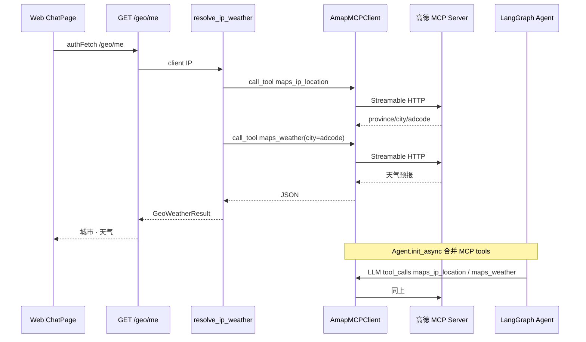

# MCP + 高德 — 本质与 BillMind 实现

> 里程碑：**M6** · 代码入口：`agent/mcp/gaode/`、`server/api/geo.py`、`GET /geo/me`

## 一句话本质

**MCP（Model Context Protocol）= 用统一协议把外部能力（地图、天气等）暴露为 tools，Agent 与 REST API 共用同一 MCP 客户端，而不是各写一套 REST 直连。**

BillMind 通过 `langchain-mcp-adapters` 的 `MultiServerMCPClient` 以 **Streamable HTTP** 连接高德官方 MCP Server，注册 `maps_ip_location` 与 `maps_weather`，供 LangGraph `bind_tools` 与 `GET /geo/me` 复用。

---

## 常见误解 vs 本质

| 误解 | 本质 |
|------|------|
| MCP = 又一个 OpenAPI | MCP 定义 **tool 发现 + 调用** 的会话协议；LangChain 侧转为 `@tool` 供 LLM `bind_tools` |
| 每个功能都要 npx 起 stdio 子进程 | 高德已提供 **远程 Streamable HTTP** endpoint；BillMind 统一 `https://mcp.amap.com/mcp?key=...` |
| REST `/geo/me` 应直接调高德 REST API | 里程碑要求 **共用 MCP 客户端**，体现 MCP 研究目标 |
| MCP tools 只能给 Agent 用 | `resolve_ip_weather` 在编排层 **直接 `call_tool`**，与 Agent 共享 `AmapMCPClient` |

---

## 核心流程

### Step 1 — 连接 MCP（启动时）

`Agent.init_async()` → `AmapMCPClient.init()` → `MultiServerMCPClient({"amap": {transport: streamable_http, url}})` → `get_tools()` 过滤 ip/weather。

### Step 2 — REST 编排

`GET /geo/me` 从 `Request` 取 IP（`utils/client_ip.py`）→ `resolve_ip_weather(ip)` 依次调用两个 MCP tool → 返回 `GeoMeResponse`。

### Step 3 — Agent 集成

`build_agent_graph(tools=skill_tools + mcp_tools)`；system prompt 在有 MCP 时允许「本地天气」类请求；`POST /agent/chat` 在 message 末尾附加 `用户当前 IP: ...` 供 `maps_ip_location` 使用。

---

## 关键概念

| 概念 | 说明 |
|------|------|
| Streamable HTTP | MCP 2025-03 推荐的 HTTP 传输；高德 SSE 已下线，BillMind 使用 `streamable_http` |
| `MultiServerMCPClient` | `langchain-mcp-adapters` 多 server 客户端；默认 **无状态**，每次 tool 调用自建 session |
| `maps_ip_location` | IP → 省/市/adcode |
| `maps_weather` | city/adcode → 天气预报 |
| `AMAP_MAPS_API_KEY` | 仅 `.env` 配置，**不写入代码或 Git** |

---

## 与相邻技术对比

| 维度 | MCP（M6） | Function Calling skill（M2） | LangGraph（M4） |
|------|-----------|------------------------------|-----------------|
| 能力来源 | 外部 MCP Server | 项目内 `@tool` + DB | 编排循环 |
| 注册方式 | `get_tools()` 动态发现 | `discover_skill_modules` | `bind_tools(all_tools)` |
| 状态 | 远程无状态 HTTP | 本地 PostgreSQL | checkpointer + thread_id |

---

## BillMind 代码对照表

| 步骤 / 概念 | 文件 / 函数 | 说明 |
|-------------|-------------|------|
| MCP 客户端 | `agent/mcp/gaode/mcp_client.py` → `AmapMCPClient` | 单例、`get_tools`、`call_tool` |
| IP+天气编排 | `agent/mcp/gaode/geo.py` → `resolve_ip_weather` | 先 location 再 weather |
| 环境变量 | `common/env.py` → `get_amap_api_key` | 未配置返回 None |
| 客户端 IP | `utils/client_ip.py` → `get_client_ip` | X-Forwarded-For / client.host |
| REST API | `server/api/geo.py` → `GET /geo/me` | Bearer 鉴权 |
| Agent 启动 | `agent/graph/agent.py` → `init_async` | 合并 MCP tools |
| System prompt | `agent/agent/promt/system.py` | 有 MCP 时允许天气查询 |
| Web 展示 | `web/src/api/geo.ts`、`ChatPage.tsx` | header 城市/天气 |
| Demo | `examples/03_amap_mcp_demo.py` | 独立脚本验收 |

---

## 常见误区

1. **把 Key 写进代码** — 只放 `.env`；对话中暴露的 Key 应在高德控制台轮换。
2. **127.0.0.1 定位不准** — 本地开发可用 `?ip=114.114.114.114` 调试；集成测试同样带 query。
3. **无 Key 仍期望 MCP 可用** — `AmapMCPClient.get_tools()` 返回空列表；Agent 仍拒答天气；`/geo/me` 返回 503。

---

## 官方文档

- [Model Context Protocol 规范](https://modelcontextprotocol.io/)
- [MCP Streamable HTTP 传输](https://modelcontextprotocol.io/specification/2025-03-26/basic/transports#streamable-http)
- [LangChain MCP 文档](https://docs.langchain.com/oss/python/langchain/mcp)
- [langchain-mcp-adapters](https://github.com/langchain-ai/langchain-mcp-adapters)
- [高德 MCP Server](https://mcp.amap.com/)

---

## 里程碑与延伸阅读

- 课表对应节：[docs/learning-plan.md](../learning-plan.md)
- 索引：[docs/knowledge/README.md](./README.md)
- 交付单：[.harness/Changes/M6_1-amap-mcp.plan](../../.harness/Changes/M6_1-amap-mcp.plan)
