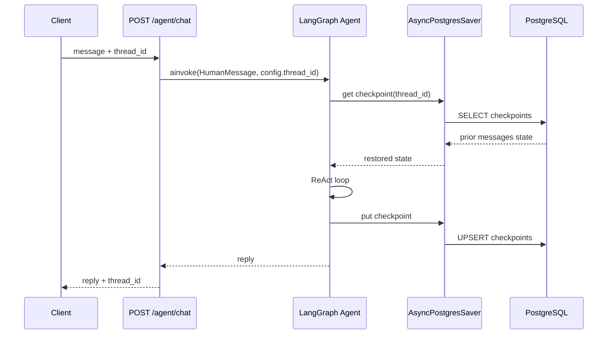
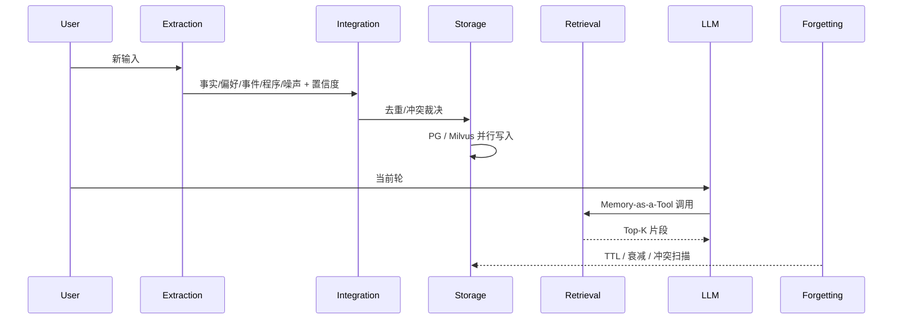

# Memory OS — 本质与 BillMind 实现

> 里程碑：**M9** · 代码入口：`agent/storage/`、`agent/graph/agent.py`

## 一句话本质

Memory OS = **分层存储** + **五阶段记忆处理流水线** + **Context Engineering**；不是「聊天记录表」本身，而是 Agent 如何在多轮对话中**提取、整合、存储、检索、遗忘**信息，并按需注入 LLM 上下文。

---

## 常见误解 vs 本质

| 误解 | 本质 |
|------|------|
| 一张 chat 表就是 Memory | Chat 表是**可读业务历史**；LangGraph checkpointer 存的是**图状态快照**，二者职责不同 |
| MemorySaver 能跑通测试就可上生产 | `MemorySaver` 仅进程内 RAM，**重启即丢**；生产须 `AsyncPostgresSaver` 等外部持久化 |
| 每轮自动注入全量历史 | 生产推荐 **Memory-as-a-Tool**：Agent 主动决定何时 recall |
| RAG 知识库 = 用户长期记忆 | RAG 是**静态/半静态知识**；用户事实、偏好需独立长期记忆层（Milvus `user_facts` 等，M9+ 规划） |
| Checkpointer = Store | Checkpointer 管**单会话短期 state**；Store 管**跨会话长期偏好/事实** |

---

## 9 类 Memory 全景

| 类型 | 数据特征 | 生产推荐存储 | Embedding | BillMind 现状 (M9) |
|------|----------|--------------|-----------|-------------------|
| **User Profile** | 结构化、低频更新 | PostgreSQL | 可选 | `accounts` 表（HTTP 层直连 service） |
| **Chat History** | 时序消息、可查询 | PostgreSQL (+ OSS 冷归档) | 可选 | `conversations` + `chat_messages` |
| **Working Memory** | 当前会话 state、高频读写 | Redis / **PostgreSQL Checkpointer** | 否 | `AsyncPostgresSaver` → `agent/storage/working/` |
| **Knowledge Memory** | 静态文档、FAQ | Milvus | 是 | `agent/storage/rag/knowledge.py` |
| **Semantic Recall** | 用户交易/事件向量 | Milvus | 是 | `agent/storage/rag/transaction.py` |
| **Long-term Facts** | 用户事实、偏好 | Milvus / PG | 是 | `planned/long_term.py` stub |
| **Behavior** | 点击/路径日志 | ClickHouse | 否 | `planned/behavior.py` stub |
| **Emotion** | 情绪标签、强度 | Redis + PG | 可选 | `planned/emotion.py` stub |
| **Task** | 进行中任务状态 | Redis + PG | 否 | `planned/task.py` stub |
| **Graph** | 实体关系 | Neo4j | 可选 | `planned/graph.py` stub |

基础设施：`docker-compose.yml` 已含 PostgreSQL、Milvus、MinIO、Ollama。

---

## MemorySaver 与 Checkpointer 机制

LangGraph 用「检查点」保存 Agent **运行状态快照**（当前 `messages`、图 state）；按 `configurable.thread_id` 隔离不同对话线程。

### 存储技术定位（两维度）

| 维度 | 说明 |
|------|------|
| **Checkpointer** | 保存图 state 快照；`thread_id` 分区 |
| **In-Memory (`MemorySaver`)** | 数据在 RAM；**进程重启即丢失**；零外部依赖 |

### MemorySaver 要点

- **作用**：短期、线程级上下文（多轮对话）
- **官方定位**：**仅开发/测试**（轻量、零依赖）
- **核心限制**：**禁止生产** — 无法持久化、扩缩容/重启丢会话
- **BillMind M4**：`agent/graph/agent.py` 曾用 `MemorySaver()` + `thread_id`（详见 [langgraph.md](langgraph.md)）
- **BillMind M9**：`AsyncPostgresSaver`，复用 `DATABASE_URL`；`MemorySaver` 仅作文档对照，测试可在 pytest 内 mock

### 生产替代：AsyncPostgresSaver

- 外部 PostgreSQL 持久化；LangGraph 自建 `checkpoints` / `checkpoint_blobs` 等表（**不走 Alembic**）
- BillMind 选用 async 版以匹配 FastAPI 栈
- 实现：`agent/storage/working/checkpointer.py`

### MemorySaver vs LangGraph Store（长期记忆）

| 机制 | 职责 | BillMind |
|------|------|----------|
| **Checkpointer** | 单会话内短期 state | `thread_id` + `AsyncPostgresSaver` |
| **Store** | 跨会话用户偏好、长期事实 | M9 文档规划；`planned/long_term.py` |

---

## 五阶段记忆处理流水线

| 阶段 | 机制要点 | BillMind 落点 (M9) |
|------|----------|-------------------|
| **Extraction 提取** | LLM 异步提取五类信息；附带置信度、实体、时间戳 | 文档 + `pipeline/extraction.py` stub |
| **Integration 整合** | 余弦相似度 ~0.82 判重/冲突；审计轨迹 | 文档 + `pipeline/integration.py` stub |
| **Storage 存储** | 按类型路由 PG / Milvus，并行写入 | **M9 实现**：checkpointer + chat 表 + Milvus facade |
| **Retrieval 检索** | Memory-as-a-Tool；混合检索语义+BM25+实体 | `search_knowledge` / `search_similar_transactions`；`pipeline/retrieval.py` stub |
| **Forgetting 遗忘** | TTL 归档、衰减、冲突扫描 | 文档 + `pipeline/forgetting.py` stub |

---

## 历史聊天数据压缩方案（5 种）

解决 **Context Bloat** / **Lost in the Middle**。与下方「7 层策略」交叉引用。

| # | 方案 | 机制 | 效果 / 适用 | BillMind 规划 |
|---|------|------|-------------|---------------|
| 1 | **分层摘要 Hierarchical Summarization** | 近 5–10 轮原文；10–30 轮详细摘要；更早 broad 摘要 | ~80% token 缩减 | M9+ `pipeline/summary.py` |
| 2 | **主动上下文压缩 Active Context Compression** | Agent 将轨迹压为知识块并删原始日志 | SWE-bench 22.7% 缩减 | M10 Loop engineering 联动 |
| 3 | **锚定迭代摘要 Anchored Iterative Summarization** | 锚点：intent / changes / decisions / next_steps | Factory.ai 4.04/5 | M11 月报候选 |
| 4 | **检索增强记忆 RAG-based Memory** | 全历史入向量库，Top-K 注入 | Mem0 token 大幅节省 | M7/M8 Milvus + M9 chat 表 |
| 5 | **蒸馏 Distillation** | 保留精确路径、错误信息原文 | 编码 Agent 精确召回 | `planned/long_term.py` |

---

## 7 层历史压缩策略（补充索引）

| 层 | 机制 | M9 状态 |
|----|------|---------|
| 1 Sliding Window | 保留最近 N 轮 | checkpointer 自然累积 + chat 表 |
| 2 Summarization | 旧轮摘要 | stub `pipeline/summary.py` |
| 3 Entity Extraction | 抽实体入长期记忆 | stub `pipeline/extraction.py` |
| 4 RAG Recall | 向量检索历史片段 | M7/M8 雏形 |
| 5 Pruning | 删低价值轮次 | stub `pipeline/forgetting.py` |
| 6 Anchored Summary | 结构化锚点摘要 | stub `pipeline/summary.py` |
| 7 Decay | 时间衰减权重 | stub `pipeline/forgetting.py` |

---

## 2026 主流技术栈

| 组件 | 主流选型 | BillMind M9 |
|------|----------|-------------|
| Working Memory | Postgres / Redis checkpointer | `AsyncPostgresSaver` |
| Chat History | PostgreSQL | `conversations` + `chat_messages` |
| Knowledge / Semantic | Milvus + Ollama embedding | `agent/storage/rag/` |
| Long-term Facts | Mem0 / 自研 Milvus 集合 | `planned/` |
| Orchestration | LangGraph | `agent/graph/` |

---

## BillMind 代码对照表

| 步骤 / 概念 | 文件 / 函数 | 说明 |
|-------------|-------------|------|
| Storage 入口 | `agent/storage/__init__.py` | `init` / `shutdown` |
| Working Memory | `agent/storage/working/checkpointer.py` | `init` / `get` / `shutdown` |
| Chat History | `agent/storage/postgres/chat.py` | `remember_turn` / `list_messages` |
| Knowledge | `agent/storage/rag/knowledge.py` | Milvus 知识库检索 |
| Semantic Recall | `agent/storage/rag/transaction.py` | Milvus 交易语义检索 |
| Graph 运行时 | `agent/graph/agent.py` | `storage.working.get_checkpointer()` |
| HTTP 落库 | `server/api/agent.py` | invoke 后 `remember_turn` |
| REST 历史 | `server/api/conversations.py` | `GET /conversations` |

---

## 常见误区

1. **checkpointer 表 ≠ 业务 chat 表** — 前者存图序列化 state，后者供 Web 展示与 SQL 查询。
2. **RAG 知识 ≠ 用户长期记忆** — 理财 FAQ 与用户「不吃香菜」是不同集合。
3. **MemorySaver 能跑通跨轮测试 ≠ 可用于生产** — 重启 server 即丢会话。
4. **Checkpointer（短期）≠ Store（跨会话长期）** — M9 仅升级 checkpointer + 业务 chat 表。
5. **每轮自动注入全量历史 ≠ Memory-as-a-Tool** — BillMind 保持 LLM 按需调 `search_knowledge` 等 tool。
6. **叙事性摘要 ≠ Distillation** — 编码 Agent 需保留精确字符串。

---

## 官方文档

- [LangGraph Persistence / Checkpointer](https://langchain-ai.github.io/langgraph/concepts/persistence/)
- [langgraph-checkpoint-postgres](https://github.com/langchain-ai/langgraph/tree/main/libs/checkpoint-postgres)
- [Mem0](https://docs.mem0.ai/)
- [Factory.ai — Anchored Summarization](https://factory.ai/)

---

## 里程碑与延伸阅读

- LangGraph 基础：[langgraph.md](langgraph.md)（MemorySaver 段落已链至本文 § MemorySaver）
- RAG：[rag.md](rag.md) · 交易语义：[txn-semantic-search.md](txn-semantic-search.md)
- 索引：[docs/knowledge/README.md](README.md)
- HITL（M12）：[memory-hitl.md](memory-hitl.md)
