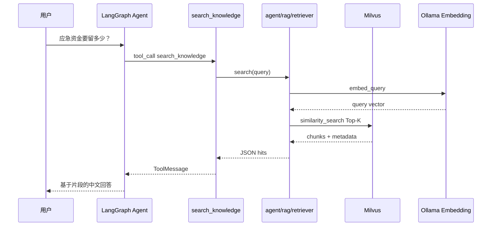

# RAG 知识库 — 本质与 BillMind 实现

> 里程碑：**M7** · 代码入口：`agent/knowledge/`、`agent/rag/`、`agent/skills/knowledge.py`、`GET /knowledge/search`

## 一句话本质

**RAG（Retrieval-Augmented Generation）= 先检索与问题相关的知识片段，再让 LLM 基于检索结果回答，避免规则类问题靠模型「幻觉」。**

BillMind 将 `agent/knowledge/finance/` 下理财 Markdown 分块、经 **Ollama Embedding** 写入 **Milvus**，Agent 通过 `search_knowledge` skill 检索后组织中文回复。

---

## Embedding 是什么（必须理解）

**Embedding** 把一段文本映射为固定长度的浮点向量（如 768 维）。语义相近的文本，向量在空间中距离更近。

| 概念 | BillMind 中的实现 |
|------|-------------------|
| Embedding 模型 | Ollama `nomic-embed-text`（`OLLAMA_EMBEDDING_MODEL`） |
| 向量化时机 | 索引阶段：`agent/rag/indexer.py` 分块后调用 `OllamaEmbeddings.embed_documents` |
| 存储 | Milvus 集合 `billmind_knowledge`，字段含 `vector` + metadata（`kb`/`source`/`title`） |
| 查询 | 用户问题 → 同一模型 `embed_query` → Milvus 相似度 Top-K |

**注意**：Embedding 只负责「找相似文本」，不生成最终答案；生成仍由 DeepSeek Chat（Agent LLM）完成。

---

## RAG 使用场景（BillMind 内）

| 场景 | 知识库 `kb` | 示例用户问题 | 应走 RAG 而非 DB tool |
|------|-------------|--------------|------------------------|
| 理财常识 | `finance` | 「应急资金要留多少？」 | 是 |
| 个人账单 | — | 「今天花了多少？」 | **否**，走 `get_daily_summary` 等 skill |

**原则**：事实来自用户数据库的 → skill；来自静态文档的 → RAG。

---

## 常见误解 vs 本质

| 误解 | 本质 |
|------|------|
| RAG = 让 LLM 记住所有文档 | 每次只检索 Top-K 片段注入上下文 |
| 有 RAG 就不需要 system prompt | prompt 仍定义工具边界；RAG 补充领域知识 |
| 必须用 LlamaIndex | BillMind 用 LangChain + `langchain-milvus` + 自研 `agent/rag/` |
| 索引随 Git 自动更新 | 改 Markdown 后需 `python -m agent.rag.index` 或重启且集合为空 |

---

## 核心流程

### Step 1 — 索引（启动或 CLI）

`index.py` / `rag.index()`：扫描 `agent/knowledge/finance/*.md` → 分块 → Milvus。

### Step 2 — 检索（Agent / REST）

`search_knowledge` 或 `GET /knowledge/search?q=...` → Milvus 相似度搜索 → 返回 `text` + `source` + `title`。

### Step 3 — 生成

LLM 阅读 tool 返回的片段，用简洁中文回答并可在回复中体现来源。

---

## 关键概念

| 概念 | 说明 |
|------|------|
| Chunk | 长文档切分后的片段（500 字，overlap 50） |
| `kb` | 知识库分类 metadata，用于过滤检索范围 |
| Milvus standalone | Docker 向量库，端口 19530 |
| `search_knowledge` | Agent skill，与记账 skill 并列注册 |

---

## BillMind 代码对照表

| 步骤 / 概念 | 文件 / 函数 |
|-------------|-------------|
| 知识源 | `agent/knowledge/finance/*.md` |
| RAG 门面 | `agent/rag/rag.py` → `RAG` 类 + 单例 `rag` |
| 索引 | `RAG.index()` / `python -m agent.rag.index` |
| 向量库 | `RAG` 内 Milvus 封装（集合 `billmind_knowledge`） |
| 检索 | `RAG.search()` / `RAG.search_as_dicts()` |
| Agent skill | `agent/skills/knowledge.py` → `search_knowledge` |
| REST 调试 | `server/api/knowledge.py` → `GET /knowledge/search` |
| 启动串联 | 手动 `python -m agent.rag.index` 入库；服务启动不自动索引 |
| CLI 重建 | `python -m agent.rag.index` |
| Demo | `examples/04_rag_knowledge_demo.py` |

---

## 常见误区

1. **未 pull embedding 模型** — 需 `ollama pull nomic-embed-text`。
2. **Milvus 未启动仍期望 RAG** — 检索无结果；需先 `python -m agent.rag.index` 入库。
3. **占位文档未填正文** — 索引 chunk 数为 0，检索无命中。
4. **混淆 M7 与 M8** — M7 检索静态知识；M8 才是交易记录语义搜索。

---

## 官方文档

- [Milvus 文档](https://milvus.io/docs)
- [LangChain Milvus 集成](https://python.langchain.com/docs/integrations/vectorstores/milvus/)
- [Ollama Embeddings](https://python.langchain.com/docs/integrations/text_embedding/ollama/)

---

## 里程碑与延伸阅读

- 课表：[docs/learning-plan.md](../learning-plan.md)
- 索引：[docs/knowledge/README.md](./README.md)
- 交付单：[.harness/Changes/M7_1-rag-knowledge.plan](../../.harness/Changes/M7_1-rag-knowledge.plan)
