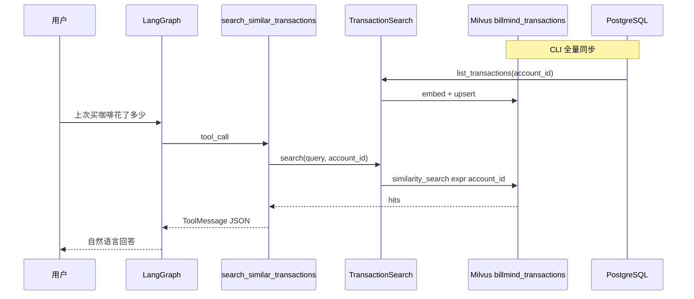

# 交易语义搜索 — 本质与 BillMind 实现

> 里程碑：**M8** · 代码入口：`agent/rag/transaction.py`、`agent/skills/transactions_semantic.py`、`GET /transactions/search`

## 一句话本质

**交易语义搜索 = 把每笔账单格式化为文本、向量化存入 Milvus，用自然语言模糊回忆（「上次星巴克」）做相似度检索，而非 SQL 精确过滤。**

与 M7 知识库 RAG 平行：数据源是 PostgreSQL 交易表，集合名为 `billmind_transactions`，按 `account_id` 租户隔离。

---

## 与 M7 / SQL skill 的分工

| 用户问法 | 应走 | 原因 |
|----------|------|------|
| 「上次星巴克花了多少」「类似出差住宿的消费」 | `search_similar_transactions` | 模糊语义，无明确月份/日期/金额 |
| 「本月餐饮花了多少」 | `get_monthly_summary` | 有明确月份聚合 |
| 「6 月所有餐饮明细」 | `query_transactions` | 有明确月份列表 |
| 「今天最接近 20 块的是哪笔」 | `find_closest_transaction` | 有明确日期 + 金额 |
| 「应急资金要留多少」 | `search_knowledge`（M7） | 静态理财文档，非个人账单 |

`@tool_policy` 的 `forbid_tools` 与 system prompt 意图规则双向约束，避免 Agent 混用 SQL 与语义检索。

---

## 核心流程



---

## 文档文本与 metadata

每笔交易一条向量（无需分块）：

| 字段 | 说明 |
|------|------|
| 文本 | `{date} {category} {merchant} {note} {amount}元` |
| metadata | `account_id`, `transaction_id`, `category`, `merchant`, `amount`, `transacted_at` |

格式化方法：`Transaction.embedding_text()`（见 `server/model/transaction.py`）。

---

## 索引生命周期

| 方式 | 命令 / 触发点 | 说明 |
|------|----------------|------|
| 全量 CLI | `python -m agent.rag.transaction --account-id 1` | 从 PG 拉该账号全部交易 |
| 强制重建 | `--force` | 删除该账号已有向量后重写 |
| 增量（Phase 2） | `add_transaction` / CSV 导入成功 | 受 `TXN_SEARCH_INCREMENTAL` 控制，默认开启 |

关闭增量索引（仅 CLI 全量同步时）：

```bash
# .env
TXN_SEARCH_INCREMENTAL=0
```

---

## 代码落点

| 组件 | 路径 |
|------|------|
| 向量门面 | `agent/rag/transaction.py` → `TransactionRagService` / `transaction_rag` |
| CLI | `python -m agent.rag.transaction` |
| Agent skill | `agent/skills/transactions_semantic.py` → `search_similar_transactions` |
| REST 调试 | `server/api/transactions.py` → `GET /transactions/search` |
| Demo | `examples/05_txn_semantic_demo.py` |
| 单测 | `agent/rag/transaction_test.py` |

---

## 常见误解

| 误解 | 本质 |
|------|------|
| 语义搜索能替代月度汇总 | 汇总仍走 SQL；语义搜索只做 Top-K 相似笔 |
| 记一笔后自动可搜 | 需开启 `TXN_SEARCH_INCREMENTAL`（默认开）或手动跑 `python -m agent.rag.transaction` |
| 与 M7 共用同一 Milvus 集合 | 独立集合 `billmind_transactions`，与 `billmind_knowledge` 分离 |
